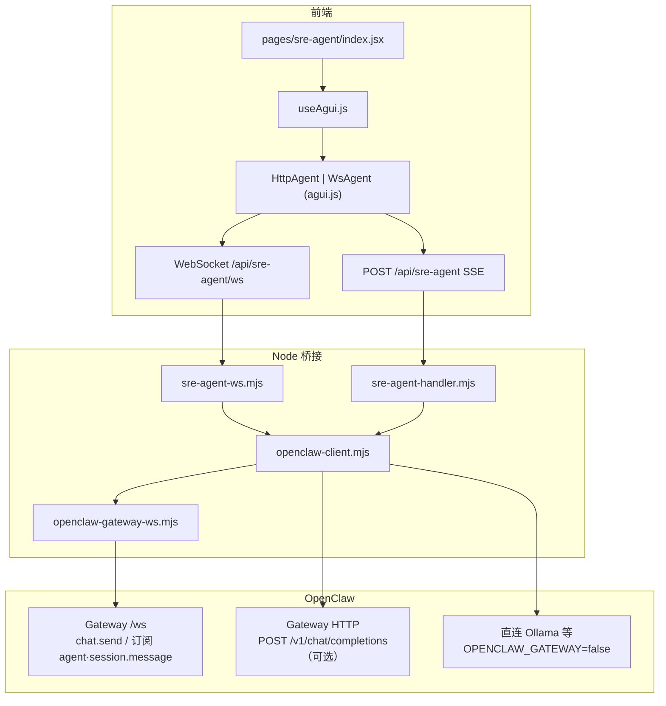

# SRE Agent：AG-UI 架构与 OpenClaw 对接说明

本文描述本仓库内 **AG-UI（Agent User Interaction Protocol）** 事件的分类、字段约定，以及 **浏览器 → Node 桥接 → OpenClaw** 的完整数据路径。规范背景见 [AG-UI 文档](https://docs.ag-ui.com)。

执行路径、环境与部署要点仍以 `[SRE-Agent-Architecture.md](./SRE-Agent-Architecture.md)` 为准；右侧报告 / 任务推送细则见 `[SRE-Agent-Workspace-Push-Rules.md](./SRE-Agent-Workspace-Push-Rules.md)`。

---

## 1. 分层与数据流

**要点**

- 前后端契约是 **同一套 JSON 形态的 AG-UI 事件**（`type` 为主判别字段）。
- **默认**：`WsAgent` + `sre-agent-ws.mjs`；**可选**：`VITE_SRE_AGENT_TRANSPORT=sse` 使用 `HttpAgent` + SSE。
- **Gateway 模式**（`OPENCLAW_API_URL` 指向网关）：`runSreAgent` 走 `**runSreAgentViaWs`**（OpenClaw Gateway WebSocket + `chat.send`）。
- **非网关**：`runSreAgentViaHttp`（流式 Chat Completions SSE，解析后同样产出 AG-UI 事件）。

---

## 2. 前端传输层：`agui.js`

| 类           | 用途                                                                        |
| ----------- | ------------------------------------------------------------------------- |
| `HttpAgent` | `POST /api/sre-agent`，`Accept: text/event-stream`，按行解析 `data: {JSON}`     |
| `WsAgent`   | 连接 `/api/sre-agent/ws`，JSON 文本帧；先 `connect()`，再 `runAgent` 发送 `op: "run"` |
| `MockAgent` | 本地场景脚本，不参与 OpenClaw                                                       |

**会话范围消息**（与网关 `sessionKey` 对齐）：默认每次 run 只发送**本轮用户句**，历史由服务端会话恢复。开关见 `frontend/pages/sre-agent/constants.js` 中 `SRE_SESSION_SCOPED_USER_MESSAGES`（`VITE_SRE_AGENT_FULL_MESSAGES=true` 可发全量 `messages`）。

**WsAgent 会话增量**：进入会话界面并 `connect()` 后，`startSessionPoll` 约每 3s 发送 `op: "poll_session"`；**run 占用 subscriber 期间**不 poll（避免与流式重复）。推送事件走 `_sessionPushHandler`，与 `runAgent` 的 `_runSubscriber` 互斥（同一 hook 内由 `useAgui` 编排）。

---

## 3. AG-UI 事件类型（五大类）

定义位置：`frontend/lib/agui.js` 导出的 `EventType`。

| 大类                  | `type` 取值                                                                   |
| ------------------- | --------------------------------------------------------------------------- |
| **Lifecycle**       | `RUN_STARTED`, `RUN_FINISHED`, `RUN_ERROR`, `STEP_STARTED`, `STEP_FINISHED` |
| **TextMessage（流式）** | `TEXT_MESSAGE_START`, `TEXT_MESSAGE_CONTENT`, `TEXT_MESSAGE_END`            |
| **ToolCall（流式）**    | `TOOL_CALL_START`, `TOOL_CALL_ARGS`, `TOOL_CALL_END`, `TOOL_CALL_RESULT`    |
| **State**           | `STATE_SNAPSHOT`, `STATE_DELTA`, `MESSAGES_SNAPSHOT`                        |
| **Special**         | `RAW`, `CUSTOM`                                                             |

后端 `openclaw-client.mjs` 内有一份与之对齐的常量子集（用于 Gateway WS 路径发射事件）。

---

## 4. 常用字段约定

以下字段在 Gateway 翻译与 `useAgui` 归约中反复出现：

| 字段                | 含义                                                                               |
| ----------------- | -------------------------------------------------------------------------------- |
| `messageId`       | 助手气泡 id；`TEXT_MESSAGE_*` 三联共享；`CUSTOM.sre_task_plan_update.value.messageId` 与之对齐 |
| `streamKey`       | 可选；区分主会话与子会话等多路流（如 OpenClaw `sessionKey`），用于 UI 区分来源                             |
| `parentMessageId` | 工具调用归属的助手气泡 id（`TOOL_CALL_*`）                                                    |
| `toolCallId`      | OpenClaw / 网关侧工具调用 id；`STEP_*` 可与思考链逐步配对                                         |

`useAgui` 使用 `streamMergeMapRef` / `activeStreamSetRef` 处理多路 `TEXT_MESSAGE_*` 合并策略（同一连接上主流 + 子流并存时的边界情况）。

---

## 5. RunAgentInput（请求体）

`HttpAgent` / `WsAgent` 的 `runAgent({ messages, tools, context, state })` 与 POST body / `op: "run"` 载荷对齐，核心字段包括：

- `agentId`：所选 OpenClaw Agent（与环境默认 `OPENCLAW_AGENT_ID` 协同）
- `threadId`：应用侧会话 id（如 `opsRobot_thread_*`）
- `runId`：单次运行 id（客户端生成）
- `messages`：OpenAI 风格 role/content 数组（默认仅增量用户消息，见第 2 节）

服务端据此解析并调用 `runSreAgent(input, emit, signal)`。

---

## 6. OpenClaw 对接详解

### 6.1 Gateway WebSocket 客户端

`backend/sre-agent/openclaw-gateway-ws.mjs`：`GatewayWsClient` 单例，连接 `{OPENCLAW_API_URL 对应的 ws}/ws`，握手后支持：

- `request(method, params)`：如 `chat.send`、`sessions.messages.subscribe` 等
- `addEventHandler(eventName, handler)`：监听推送，关键是 `**agent`** 与 `**session.message**`

### 6.2 `runSreAgentViaWs`：网关事件 → AG-UI

实现：`openclaw-client.mjs` 中 `runSreAgentViaWs`。文档化映射（与源码注释一致）：

| OpenClaw Gateway `agent` 流            | AG-UI                                              |
| ------------------------------------- | -------------------------------------------------- |
| `stream: "lifecycle", phase: "start"` | `STEP_STARTED`（如「生成回复」）等                           |
| `stream: "assistant", data.delta`     | `TEXT_MESSAGE_START` / `CONTENT`                   |
| `stream: "lifecycle", phase: "end"`   | `TEXT_MESSAGE_END`、`STEP_FINISHED`、收尾              |
| `stream: "tool", phase: "start"`      | `TOOL_CALL_START`、`STEP_STARTED`（含 `toolCallId`）   |
| `stream: "tool", phase: "result"`     | `TOOL_CALL_END`、`TOOL_CALL_RESULT`、`STEP_FINISHED` |

`**sessions_spawn**`：在工具生命周期内额外发射 `**CUSTOM`，`name: "sre_task_plan_update"**`（结构化 spawn，供左侧任务列表与消息推导合并）。字段说明见 `[SRE-Agent-Workspace-Push-Rules.md` §9](./SRE-Agent-Workspace-Push-Rules.md)。

HTTP 直连路径将 OpenAI 兼容 SSE 解析后同样产出 `TEXT_MESSAGE_*`、`TOOL_CALL_*`、收尾 `CUSTOM`（如 workspace / confirm），详见 `processStreamResponse` 一带实现。

### 6.3 人机确认与 Markdown

前后端共用 `frontend/lib/aguiConfirmBlock.js`：`parseAssistantConfirmSources` 处理 `confirm` 代码块与文末「如需…请告知」类邀约。助手流结束时若解析出确认载荷，可配合 `**CUSTOM`，`name: "confirm"**` 或前端在 `TEXT_MESSAGE_END` 路径直接 `setConfirm`。

---

## 7. 浏览器 ↔ Node：`sre-agent-ws.mjs` 协议

WebSocket 消息为 JSON，`op` 区分语义：

| `op`           | 行为                                                                                                                                                                                                                                                                                |
| -------------- | --------------------------------------------------------------------------------------------------------------------------------------------------------------------------------------------------------------------------------------------------------------------------------- |
| `run`          | `busy` 锁；`ws._sreActiveRun = true`；`runSreAgent(body, emit)`，逐帧 `safeSend` AG-UI JSON                                                                                                                                                                                             |
| `abort`        | `AbortController.abort()`，中断当前 run                                                                                                                                                                                                                                                |
| `poll_session` | 异步 `handlePollSession`：拉取/订阅会话，推送 `CUSTOM openclaw_session_detail`；在无并行用户 run 时订阅 Gateway `**agent**`，将 `**stream:"tool"**` 译为 `TOOL_CALL_*` / `STEP_*`，并对 `sessions_spawn` 发射 `sre_task_plan_update`（与 `run` 路径行为对齐）。用户 `**run` 进行中**时主流式 handler 跳过，避免与 `runSreAgentViaWs` 重复推送 |

帧格式即为 AG-UI 事件对象（例如 `{ "type": "TEXT_MESSAGE_CONTENT", ... }`），无额外信封。

---

## 8. `CUSTOM` 扩展一览（前端 `useAgui` 已处理）

| `name`                    | 作用               | `value` 要点                                                                                                                                |
| ------------------------- | ---------------- | ----------------------------------------------------------------------------------------------------------------------------------------- |
| `openclaw_session_detail` | 会话历史增量 / 全量合并    | `detail`、`incremental`、`tailMessages`、`replaceLastAssistant` 等；与 `mergeChatWithSessionHistory`、`mergeStreamingIncrementalSessionTails` 配合 |
| `workspace`               | 右侧面板 CRUD        | `action`: `add_panel` / `update_panel` / `clear`；`panel` 结构见 `WorkspaceRenderer`                                                          |
| `confirm`                 | 人机确认卡片           | 经 `normalizeConfirmPayload`                                                                                                               |
| `surfaceUpdate`           | A2UI 面板补丁        | `id` + 属性合并入 `workspacePanels`                                                                                                            |
| `dataModelUpdate`         | 合并进 `agentState` | 浅合并                                                                                                                                       |
| `图_update`                | SRE 任务规划 spawn   | `messageId` + `spawn`（含 `toolCallId`、`phase` 等）；写入 `sreTaskPlanPush`                                                                      |

右侧支持的 `panel.type` 列表见 `frontend/components/agui/WorkspaceRenderer.jsx`（含静态面板与 `sre_viz_*`、`sre_message_markdown` 等）。

---

## 9. `useAgui` 状态模型

摘自 `frontend/lib/useAgui.js` 注释，便于对照 UI：

| 状态                | 用途                                             |
| ----------------- | ---------------------------------------------- |
| `messages`        | 左侧对话（user / assistant / streaming）             |
| `toolCalls`       | 工具调用指示（按 `toolCallId` 合并）                      |
| `steps`           | Agent 思考链（`STEP_*` + `toolCallId` 配对收尾）        |
| `workspacePanels` | 右侧动态工作区                                        |
| `confirm`         | HITL 确认                                        |
| `agentState`      | `STATE_*`、`dataModelUpdate`                    |
| `status`          | `idle` / `running` / `error`                   |
| `sreTaskPlanPush` | 按 `messageId` → `toolCallId` 聚合的 spawn，供任务列表合并 |

---

## 10. A2UI 与 AG-UI 的关系

- **AG-UI**：本项目主协议（事件类型见第 3 节）。
- **A2UI**：混排 Markdown + Canvas 交互的补充约定，事件常量见 `frontend/lib/a2ui.js`。实时面板通过 `CUSTOM surfaceUpdate` / `dataModelUpdate` 驱动 `WorkspaceRenderer`；用户操作经 `POST /api/sre-agent/action` 上报（当前多为占位/日志）。

---

## 11. 源码索引

| 主题             | 路径                                          |
| -------------- | ------------------------------------------- |
| 事件枚举与 Agent 类  | `frontend/lib/agui.js`                      |
| 事件归约与 WS poll  | `frontend/lib/useAgui.js`                   |
| 会话合并 / 流式 tail | `frontend/lib/sreAgentSessionFollowUp.js`   |
| 任务规划抽取与推送合并    | `frontend/lib/sreTaskPlanExtract.js`        |
| 页面编排           | `frontend/pages/sre-agent/index.jsx`        |
| AG-UI 组件目录     | `frontend/components/agui/`                 |
| SSE 入口         | `backend/sre-agent/sre-agent-handler.mjs`   |
| App WebSocket  | `backend/sre-agent/sre-agent-ws.mjs`        |
| OpenClaw 翻译核心  | `backend/sre-agent/openclaw-client.mjs`     |
| Gateway WS 单例  | `backend/sre-agent/openclaw-gateway-ws.mjs` |

---

## 12. 小结

本仓库的 AG-UI 实现是 **「规范事件类型 + 自定义 `CUSTOM` 扩展」**：标准 Lifecycle / Text / Tool / State 承载对话与工具语义；**OpenClaw Gateway** 通过 `**GatewayWsClient` + `agent` / `session.message`** 译为上述事件；**浏览器默认**经 `**WsAgent`** 与 `**sre-agent-ws**` 在同一连接上复用 `**run**` 与 `**poll_session**`，从而在「仅围观会话」场景下仍能收到工具流与结构化任务更新。