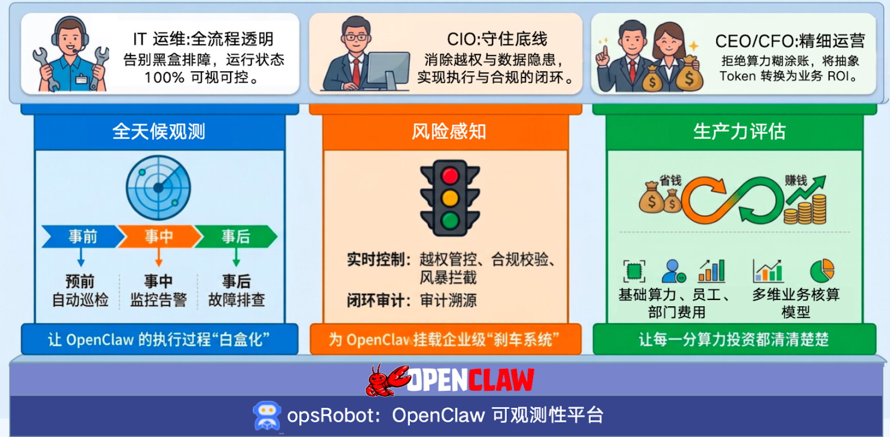

# OpenClaw Observability Platform 文档指南

🎉 欢迎阅读 **OpenClaw Observability Platform (OpenClaw 可观测性平台)** 的官方文档！

**OpenClaw 可观测性平台**，基于 KWeaver Core 框架开发，使用 OTel 协议、eBPF 技术对智能体进行全链路追踪与监管，提供故障快速排查、安全合规管控及算力精益运营的管理能力，护航 AI 赋能业务的高质量增长。

---

## 🎯 我们的使命与核心价值

在真正的企业落地实践中，大语言模型带来的不确定性和“黑盒”问题严重阻碍了自动化流程。OpenClaw 可观测平台的愿景是帮助开发与 IT 安全团队看清数字员工运行的每一处细节，兼顾效率与安全。

1. **🔭 全天候观测：让 OpenClaw 的执行过程“白盒化”**
   * **核心能力**：构建贯穿全局的观测体系，提供事前（预前自动巡检）、事中（实时监控告警）、事后（精准故障排查）的全生命周期保障。
   * **业务价值 (赋能 IT 运维)**：全流程透明，彻底告别黑盒排障，确保系统运行状态 100% 可视可控。

2. **🛡️ 风险感知：为 OpenClaw 挂载企业级“刹车系统”**
   * **核心能力**：建立坚固的安全防线，涵盖实时控制（越权管控、合规校验、风暴拦截）与闭环审计（审计溯源）两大核心机制。
   * **业务价值 (赋能 CIO)**：坚守系统底线，消除越权调用与数据安全隐患，实现业务执行与安全合规的完美闭环。

3. **📊 生产力评估：让每一分算力投资都清清楚楚**
   * **核心能力**：依托多维业务核算模型，精准拆解并追踪基础算力、员工个体及业务部门维度的费用消耗情况。
   * **业务价值 (赋能 CEO / CFO)**：驱动精细化运营，拒绝算力“糊涂账”，将抽象的大模型 Token 直观转化为清晰的业务 ROI。

---

## 📖 文档导航

我们为您准备了从入门到精通的各阶段材料。请根据您的角色与需求选择阅读内容：

### 🚀 快速起步系列
帮助您在短时间内完成本地拉起和系统接入。

- **[👉 快速入门篇](./getting-started/quick-start.md)**：包含前置要求解读、单机拉起分析前端组件、在几步内看到效果的全流程。
- **[👉 部署与数据接入拓扑](./getting-started/deployment.md)**：讲述如何在多环境安装使用 `Vector` 以及流式导入海量日志。

### 🧩 核心功能大观
深入了解控制面板上的数据逻辑和场景。

- **[👉 审计概览看板](./features/audit-dashboard.md)**：全局监控数字员工的活跃规律和安全态势。
- **[👉 会话与流水线审计](./features/session-tracing.md)**：通过拓扑图深度追踪一次复杂对话的前因后果。
- **[👉 特权变更审计](./features/config-audit.md)**：观测环境漂移，追踪系统内敏感文件覆盖溯源。
- **[👉 成本评估与分析](./features/cost-analysis.md)**：如何查看不同模型、不同通道带来的费用情况及其拆解。

### 🏗️ 架构探秘
满足开发极客的好奇心，分析数据管道内幕。

- **[👉 OTel & eBPF 数据流水线](./architecture/data-pipeline.md)**：从架构视角看日志数据抓取引擎设计如何保持轻量。

### 💻 开发者贡献指引
准备向 OpenClaw Observability Platform 发起您的第一个 PR 吗？

- **[👉 开发指南与环境构建](./development/local-setup.md)**：前后端调试要求，环境变量详解与数据库测试指南。

---

> GitHub 官方仓库: [https://github.com/aishu-opsRobot/openclaw-observability-platform](https://github.com/aishu-opsRobot/openclaw-observability-platform)
