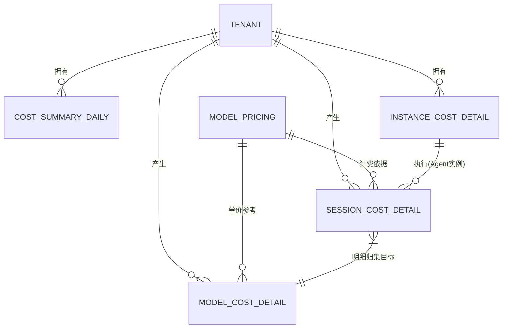

# 可管理的成本数据库表设计文档

## 概述

本文档描述了“可管理的成本”模块（包含算力成本概览、会话成本明细、实例成本明细、模型成本明细四个子功能）的底层数据库表存储结构设计。

设计目标：
1. **统一视角的成本核算**：将算力资源、大模型 Token 和底层实例运行时长转化为统一的货币开销度量。
2. **多维度的下钻分析**：支持从全局算力大盘下钻至特定实例、特定模型甚至某一通微观会话的精细化排查。
3. **数据溯源清晰**：基于日志流水汇总及底层 OTel 探针，确保所有的花销都有迹可循。

---

## 一、 实体关系 E-R 图

利用下述 E-R 图可以快速理清可管理的成本系统中各模块日志、流水和聚合实体间的关联依赖。

---

## 二、 核心数据表设计与字段含义

### 1. 算力成本概览表 (`cost_summary_daily`)
**业务场景**：对应【算力成本概览】页面，作为 T+1 离线或准实时的每日全盘统计，呈现趋势折线与环比。
**数据来源**：由离线聚合任务（如 Flink / Spark 任务或者数据库定时存储过程）每夜从会话、实例、模型三个明细表中抽取当日总和进行固化聚合。

| 字段名称 | 数据类型 | 约束 | 含义说明 | 数据来源/计算逻辑 |
| --- | --- | --- | --- | --- |
| `id` | VARCHAR(64) | PK | 概览记录主键ID | 系统生成 (UUID / 雪花算法) |
| `tenant_id` | VARCHAR(64) | IDX | 租户ID/工作空间ID | 上下文 / 账号体系 |
| `summary_date` | DATE | IDX | 统计日期 | 聚合任务按天划分时间窗口 |
| `total_cost` | DECIMAL(12,4)| | 当日总计费用消耗 | $\sum$ (会话模型费 + 实例运行费) |
| `total_tokens` | BIGINT | | 当日总计消耗 Token 数 | $\sum$ 所有会话的 input/output token |
| `total_sessions`| INT | | 当日发生的总计会话数 | 对 `session_cost_detail` 分天 count |
| `total_instances`| INT | | 当日处于活跃工作状态的实例数| 对 `instance_cost_detail` 的活跃实例合并 |
| `create_time` | DATETIME | | 记录创建时间 | 聚合任务插入时的时间库 |

---

### 2. 会话成本明细表 (`session_cost_detail`)
**业务场景**：对应【会话成本明细】页面，可呈现由于无底洞重试死循环、超长垃圾下文引致的高额消耗，实现所谓的“算力刺客捕获”。
**数据来源**：来自大模型网关 (LLM Gateway) 或 OpenClaw 引擎异步投递的 Tracing 日志。每次会话结束时通过消息队列监听流落库。

| 字段名称 | 数据类型 | 约束 | 含义说明 | 数据来源/计算逻辑 |
| --- | --- | --- | --- | --- |
| `id` | VARCHAR(64) | PK | 会话记录流水ID | 系统生成 |
| `tenant_id` | VARCHAR(64) | IDX | 租户ID | 该会话发起者所在租户 |
| `session_id` | VARCHAR(64) | IDX | 会话业务ID | 从用户应用层透传至大模型网关的 session 标记 |
| `agent_id` | VARCHAR(64) | IDX | 执行此会话的数字员工(Agent)| 对接 Agent/应用路由配置 |
| `model_id` | VARCHAR(64) | IDX | 本次所调用的大模型引擎 | e.g. `gpt-4o`, `claude-3-opus` |
| `start_time` | DATETIME | | 会话开始时间 | 记录首次收到该会话流请求时间 |
| `end_time` | DATETIME | | 会话完结时间 | 流式结果输出完毕或报错终端截断时间 |
| `input_tokens` | BIGINT | | 前置请求/上下文占用 Token| 提取自 LLM 接口 HTTP 返回的 Usage 信息 |
| `output_tokens`| BIGINT | | 大模型真实生成反馈的 Token| 提取自 LLM 接口 HTTP 返回的 Usage 信息 |
| `is_valid_output`| TINYINT(1) | | 标记是否有效产出 (1:正常 0:异常重试废料) | 根据最终错误码匹配或拦截器判断 (识别无效死循环)|
| `total_cost` | DECIMAL(10,4)| | 该单一会话核算总费用 | (input*价 + output*价) - 基于 `model_pricing` |
| `create_time` | DATETIME | | 流水落库时间 | 数据接收模块插入时间 |

---

### 3. 实例成本明细表 (`instance_cost_detail`)
**业务场景**：对应【实例成本明细】页面。监控由于实例部署冗余、长尾闲置应用产生的系统计费，作为削峰填谷、清退垃圾边缘数字角色的依据。
**数据来源**：系统级计算资源的物理探针监控 (Prometheus / OTel Metric 探针上报运行时长) 或调度器的心跳健康汇总。

| 字段名称 | 数据类型 | 约束 | 含义说明 | 数据来源/计算逻辑 |
| --- | --- | --- | --- | --- |
| `id` | VARCHAR(64) | PK | 实例记录主键ID | 系统生成 |
| `tenant_id` | VARCHAR(64) | IDX | 租户ID | 所属业务租户 |
| `instance_id` | VARCHAR(64) | IDX | 实例物理或逻辑唯一标识 | 来自 Kubernetes Pod / Agent分配唯一标记 |
| `instance_type`| VARCHAR(32) | | 实例类型(引擎节点/常驻Agent)| 系统预制字典分类 |
| `instance_name`| VARCHAR(64) | | 实例呈现名称 | 从应用层拉取的便于查看的可读姓名 |
| `record_date` | DATE | IDX | 考勤统计日期 | 每天一条归档线索 |
| `uptime_seconds`| INT | | 实例当日在线运行秒数 | Kubernetes/系统心跳打点累积监控统计 |
| `avg_cpu_usage`| DECIMAL(5,2) | | 平均 CPU 占用百分比 | 资源监控探针全天均值计算 |
| `avg_mem_mbytes`| INT | | 平均内存占用用量 (MB) | 资源监控探针全天均值计算 |
| `compute_cost` | DECIMAL(10,4)| | 折算的该实例当日运行成本 | (`uptime_seconds` $\times$ 单位单价阶梯) / 云服务实发账单拆账 |
| `create_time` | DATETIME | | 记录创建时间 | 落库时间 |

---

### 4. 模型成本明细表 (`model_cost_detail`)
**业务场景**：对应【模型成本明细】页面。针对不同服务提供商(如OpenAI/百川等)之间的接口比较图谱（谁吃掉了核心账单）、波段追踪乃至计次浪尖监测。
**数据来源**：底层网关记录通过流量聚合而来，或对 `session_cost_detail` 按不同 `model_id` / 日期进行组装推导。

| 字段名称 | 数据类型 | 约束 | 含义说明 | 数据来源/计算逻辑 |
| --- | --- | --- | --- | --- |
| `id` | VARCHAR(64) | PK | 模型流水统计ID | 系统生成 |
| `tenant_id` | VARCHAR(64) | IDX | 租户ID | |
| `record_date` | DATE | IDX | 按日分频归档日期 | |
| `model_id` | VARCHAR(64) | IDX | 具体版本的大模型名 | 如 `gpt-4o-202405` |
| `model_provider`| VARCHAR(64) | | 模型厂商发行平台 | 如 `OpenAI` / `Anthropic` / `阿里通义` |
| `total_calls` | INT | | 产生接口调动的绝对总次数 | API Gateway 日志聚合计数 Count |
| `error_calls` | INT | | 调用超时或回吐失败引发的次数 | 拦截 `status_code != 200` 等错误统计 |
| `total_input_tokens`| BIGINT | | 该模型当天的输入 Token 总计| $\sum$ `session_cost_detail` 中同模型输入之和 |
| `total_output_tokens`| BIGINT | | 该模型当天的生成 Token 总计| $\sum$ `session_cost_detail` 中同模型输出之和 |
| `total_cost` | DECIMAL(12,4)| | 模型当日总体开销度数 | 计算所有调用批次在此模型架构上的费用加和 |
| `create_time` | DATETIME | | 记录生成时间 | |

---

## 三、 异常算力消耗的原理解读

为了确保成本数据的透明性与可信度，系统建立了针对“算力损耗”的精密追踪机制。通过将底层日志流水与业务状态关联，系统能够精准识别并非由有效业务产出的“虚高”消耗，实现真正的“算力刺客”捕获。

### 1. 异常消耗的三大分类

| 异常类型 | 业务定义 | 典型场景 |
| --- | --- | --- |
| **网关无效损耗 (Gateway Loss)** | 请求已产生计费，但未能交付给用户或 Agent。 | 网络超时中断、客户端中途关闭页面、网关层安全拦截。 |
| **实例死循环损耗 (Loop Loss)** | Agent 逻辑陷入闭环或模型产生幻觉导致无限输出。 | A 任务触发 B，B 又错误触发 A；模型持续输出重复乱码。 |
| **模型异常报错 (Model Errors)** | 上游模型供应商返回错误，导致本次任务被迫终止。 | OpenAI 服务 500 错误、触发上游内容审查规则 (Content Filter)。 |

### 2. 各类异常损耗的计算细节

系统通过 OpenTelemetry (OTel) 探针实时采集每一条会话流水，并针对不同类型的异常建立了精细化的核算模型：

#### A. 网关无效损耗 (Gateway Loss)
*   **日志来源**：`gateway.log` (网关访问日志) 与 `agent_sessions.json` (会话状态摘要)
*   **关键字段**：
    *   `status`: HTTP 状态码（判定是否为 499/504 等非正常响应）
    *   `aborted_last_run`: 会话中断标记（判定是否由用户或系统强制终止）
    *   `message_usage_input`: 请求投入的上下文 Token（计费基础）
*   **计算方法**：`网关损耗 = Σ (状态为 "已中断" 或 "非200响应" 的请求产生的 Input Tokens)`。
*   **举例说明**：用户向 Agent 提问后，在模型仍在生成回复时直接关闭了浏览器标签页。此时网关记录到 `499 (Client Closed Request)`。虽然用户未获得有效回答，但上游模型可能已对 3000 个 Context Token 进行了计费。这 3000 Token 即被系统标记为“网关无效损耗”。

#### B. 实例死循环损耗 (Loop Loss)
*   **日志来源**：`agent_sessions_logs/*.jsonl` (执行流水日志)
*   **关键字段**：
    *   `message_stop_reason`: 停止原因（重点识别 `max_tokens`）
    *   `message_usage_total_tokens`: 该步骤产生的 Token 消耗
    *   `step_count`: 单次会话的交互步数
*   **计算方法**：判定条件为“单次会话步数 > 30步”且最后一步原因为“达到模型最大长度限制”。满足此条件时，该会话全量 Token 计入损耗。
*   **举例说明**：Agent 在执行文件搜索任务时逻辑陷入死循环，反复在两个目录间切换却无法得出结论，直到耗尽了模型 128k 的上下文上限。系统识别到该会话步数异常且因长度溢出停止，将这 12k Token 全部判定为“死循环损耗”。

#### C. 模型异常报错 (Model Errors)
*   **日志来源**：`agent_sessions_logs/*.jsonl` (执行流水日志)
*   **关键字段**：
    *   `message_is_error`: 显式报错标记（1 为异常）
    *   `message_stop_reason`: 停止原因（如 `content_filter`, `model_error`）
*   **计算方法**：`模型报错损耗 = Σ (is_error=1 或因内容拦截导致失败的调用所产生的 Tokens)`。
*   **举例说明**：由于模型供应商 API 突发 500 故障，请求在发送了大量上下文后被截断。即使任务失败，输入的 5000 个 Token 费用通常仍会被扣除。这 5000 Token 会被记录为“模型异常报错损耗”，方便用户向供应商发起申诉或优化调用逻辑。

### 3. 日志字段与数据库表映射关系

为了支撑上述复杂分析，系统将原始日志字段通过流转引擎提取并持久化至以下数据库字段中：

| 日志原始字段 | 业务含义 | 映射数据库表与字段 |
| --- | --- | --- |
| `message_usage_total_tokens` | 本次交互总消耗 | `session_cost_detail.total_tokens` |
| `message_is_error` | 执行是否报错 | `session_cost_detail.is_valid_output` (0: 报错) |
| `message_stop_reason` | 停止原因代码 | `session_cost_detail.is_valid_output` (0: max_tokens/error) |
| `aborted_last_run` | 会话是否被中断 | `session_cost_detail.is_valid_output` (0: 中断) |
| `message_usage_input` | 输入/上下文 Token | `model_cost_detail.total_input_tokens` |
| `timestamp` | 日志发生时间 | `cost_summary_daily.summary_date` (按天聚合) |

### 4. 数据可信度保障
- **Trace ID 全程追踪**：每一笔异常消耗都可以通过 `session_id` 下钻，在【会话成本明细】中查看原始 JSON 日志，做到“每一分钱都有据可查”。
- **T+1 离线校验**：系统每日会对实时流水进行二次审计，排除由于网络暂时抖动导致的误报，确保最终展示的损耗数据具有权威性。

---

### 附：计费依赖基准字典表 (`model_pricing`)
**数据来源**：由运营管理人员从后台配置或定时同步至模型厂商平台公告板抓取，作为所有前端费用换算的标准乘数依据。

| 字段名称 | 数据类型 | 约束 | 含义说明 |
| --- | --- | --- | --- |
| `id` | VARCHAR(64) | PK | 计价策略行ID |
| `model_id` | VARCHAR(64) | IDX | 模型统一编码字典值 |
| `input_price_1k`| DECIMAL(10,5)| | 每千个输入 Token 的价格 |
| `output_price_1k`| DECIMAL(10,5)| | 每千个输出 Token 的价格 |
| `currency` | VARCHAR(16) | | 指引货币，如 USD, CNY |
| `effective_date`| DATE | | 价格生效起始日（备查改价时效)|
