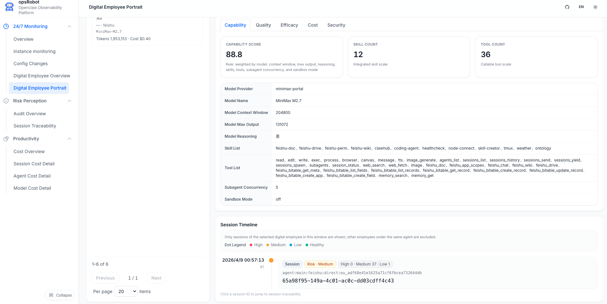

# 数字员工（概览与画像）

**数字员工模块**采用“全景概览 + 深度画像”的双星互动设计，致力于为企业提供从队伍全局统筹到单体深度追踪的全周期管理能力。借助本模块，您可以实现从宏观指标洞察到微观会话追踪的自由下钻，系统化地评估 AI Agent（智能体）的业务表现，并精准识别潜在的治理与安全风险。

---

## 🌟 核心功能与价值

在多 Agent 并行及异构化运行场景下，仅仅关注单一请求往往会“只见树木，不见森林”。数字员工模块通过“全景 + 深描”的双视角，帮助您的运营与 IT 团队建立起**可观测、可评估、可治理**的完整运营闭环：

### 1. 数字员工全景概览

概览页面是您监控 AI Agent 大军的“超级指挥中心”。通过多维度的数据切面，帮助企业管理者快速掌握当前所有数字员工的工作动态。

- **核心价值**：一站式洞察数字员工队伍在五维评估模型（能力、质量、成本、效能、安全）下的综合表现。支持通过可视化排行对比不同 Agent 的优劣势。
- **管理收益**：快速识别出“高风险员工”、“核心渠道”及“投入产出失衡”的重灾区，为资源重新调度及治理优先级排序提供关键数据支撑。

### 2. 数字员工深度画像

画像页面是聚焦单体员工的“显微镜”。当在概览中发现异常时，可通过点击下钻，以立体视角解析特定员工的每一步行为及其潜在隐患。

- **核心价值**：聚焦特定 Agent，提供从跨度数月的宏观数据到精确到分秒的微观会话流下钻分析，实现全链路的审计与行为透视。
- **管理收益**：不再满足于发现问题，而是直接将“异常现象”精准定位到具体的会话、具体的错误调用和违规策略，极大提升故障排查与问题闭环的效率。
   

### 3. 五维能力评估模型

我们在底层将原本散乱的统计数据聚合成为专业的“数字员工五维评估模型”，为每位数字员工生成全面立体的考核表：

- **能力维度 (Capability)**：评估队伍的“技能雷达”与“可用工具广度”，界定其业务处理的复杂上限。
- **质量维度 (Quality)**：实时监测“运行稳定性”与各种异常（如超时、拒绝请求等），确保交付体验的高标准。
- **成本维度 (Cost)**：多维分析“资源消耗结构”与“Token 流水账”，彻底告别大模型消耗的一笔糊涂账。
- **效能维度 (Efficiency)**：精准衡量其对于并发任务的处理耗时以及规模匹配度，量化其实际的业务贡献。
- **安全维度 (Security)**：企业合规的终极防线，实时监控命中风控策略的违规数量，守好数据安全红线。

---

## 📸 核心组件解析

### 1) 数字员工概览（全景组件）

- **核心指标看板**：实时汇总健康度、总员工数、当前活跃员工数、渠道分布情况、平均 Token 成本、P95 耗时以及命中红线的风险员工数。
- **动态驾驶舱图表**：
  - 成本与会话趋势面板（时间窗口自由选择）
  - 能力与效能热力分布
  - 质量成功率与安全红灯拦截折线图
- **Top 排行预警组件**：高风险员工黑榜 / 高效率员工红榜。支持从全局榜单中一键穿透至“单员工画像”。

### 2) 数字员工画像（深度组件）

- **员工档案与标签**：清晰展示系统唯一标识、最近活跃时间、角色标签、底层采用的 LLM 模型等基础元信息。
- **五维专属页签**：以选项卡形式深度解构“能力、质量、效能、成本、安全”五大数据域。
- **全息会话时间线**：以时间轴形式，按风险等级（高危、警告、正常）回放关键会话节点，支持一键无缝跳转至【会话溯源】页面。
- **质量明细追踪台**：弹窗式展示该员工发生过的异常中止、API 接口调用失败、意图识别偏差等细粒度追踪报表。

---

## 🔎 运维与排障联动建议

当您在数字员工面板中观察到指标异动时，建议按照以下业务流进行科学的排查验证：

**🔴 场景一：发现高风险员工比重突然上升**
1. **纵观全局**：首先在【横向概览页】中查看安全分布图表，锁定报警峰值及名单内的高风险员工。
2. **深度透视**：点击进入该员工的【数字员工画像】，切换到“安全维度”页签，确认其安全评分断崖式下跌的原因及触发的具体管控策略。
3. **定位溯源**：在时间线上挑选带有红色“Risk”标记的节点，跳转至会话溯源页，直接查看触发该合规拦截的输入输出原始报文。

**🟡 场景二：质量指标下滑（如请求成功率骤降、调用失败攀升）**
1. **寻找病灶**：在【画像页 -> 质量维度】中，核对报错归类（是 LLM 上游异常、工具鉴权失败，还是平台内部崩溃）。
2. **时间交叉**：联动其会话时间线，寻找密集报错的发生阶段。
3. **修复链路**：回看失败会话日志，优先排查高频失败动作（如某个三方工单插件接口响应超时），针对性进行代码发版修补。

**🟢 场景三：Token 成本剧烈波动**
1. **横向对齐**：在概览页的“人均成本排行榜”中，确认是偶然个体消耗大，还是整体员工耗能上升。
2. **纵向分析**：进入相关数字员工画像的“成本维度”，分析最近几周的结构变化趋势（Prompt 成本剧增 还是 Completion 回复冗长）。
3. **效能折算**：交叉对比同期的“效能维度”，判断此次成本走高是否有效地支撑了高倍的业务量提升；如果不匹配，极可能是出现了 Prompt 逻辑锁死或循环无效调用的异常情况。

---

## 🎭 研发阶段：Mock 数据使用方式

出于调试或演示目的，本模块自带一整套完整的沙盒 Mock 环境。

当您在环境配置中设置 `VITE_MOCK=true` 时，数字员工的前端接口将自动分流至 Mock 路由：
- 概览接口: `GET /api/digital-employees/overview`
- 画像接口: `GET /api/digital-employees/profile`

相应的数据将由以下本地文件提供支持，您可以自由修改它们来模拟各类的演示场景：
- `mock/data/digital-employee-overview.mjs`
- `mock/data/digital-employee-profile.mjs`

